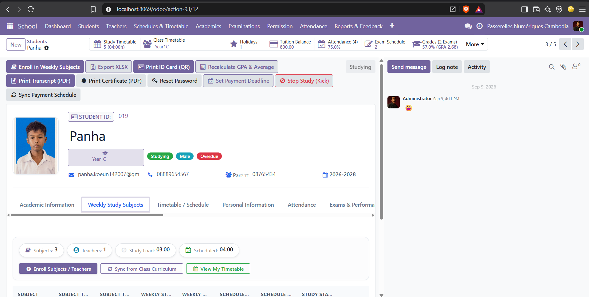

  <!-- Hero Banner -->
  

  <!-- Animated Dynamic Typing -->
  

   

  <!-- Quick Status & Profile Visitors -->
  

    
    
    
    
    
  

  <!-- Interactive Quick Navigation Jump-bar -->
  

    <a href="#-about-me"><kbd>👤 About Me</kbd></a> •
    <a href="#-flagship-odoo-school-erp"><kbd>🎓 Odoo School ERP</kbd></a> •
    <a href="#-featured-projects"><kbd>🚀 Web Projects</kbd></a> •
    <a href="#️-tech-arsenal"><kbd>🛠️ Tech Arsenal</kbd></a> •
    <a href="#-github-analytics"><kbd>📊 GitHub Stats</kbd></a> •
    <a href="#-lets-connect"><kbd>🌟 Connect</kbd></a>
  

---

### 👨‍💻 About Me & Executive Summary

<table>
  <tr>
    <td width="58%" valign="top">
      

        Hello! I'm <strong>Panha Koeun</strong>, a passionate software developer dedicated to crafting 
        <strong>high-performance web applications</strong> and <strong>scalable ERP business solutions</strong>.
        I bridge the gap between complex organizational workflows and elegant, user-friendly digital products.
      

      <ul>
        <li>🔭 <strong>Current Focus:</strong> Developing custom enterprise modules for <strong>Odoo 19 ERP</strong> (including an end-to-end <strong>School Management System</strong>) & full-stack web platforms.</li>
        <li>🎓 <strong>Education & Training:</strong> Web & Software Development at <strong>Passerelles Numériques Cambodia (PNC)</strong>.</li>
        <li>🌱 <strong>Mastering in 2026:</strong> <strong>Odoo 19</strong>, <strong>OWL (Odoo Web Library)</strong>, <strong>Advanced Python</strong>, & <strong>PostgreSQL Optimization</strong>.</li>
        <li>💼 <strong>Experience:</strong> <strong>60+ repositories</strong> built across development profiles, ranging from ERP systems and POS platforms to real-time face detection.</li>
        <li>⚡ <strong>Philosophy:</strong> Clean architecture, robust database design, intuitive user experiences, and test-driven reliability.</li>
      </ul>
    </td>
    <td width="42%" align="center" valign="middle">
      
    </td>
  </tr>
</table>

<!-- Interactive Collapsible Drawers -->

  
<strong>🔍 Click to expand: Core Architectural Specialties & Competencies</strong>

   
  <table>
    <tr>
      <th width="25%">Domain</th>
      <th width="75%">Core Capabilities & Implementation</th>
    </tr>
    <tr>
      <td><strong>🏢 ERP & Odoo 19</strong></td>
      <td>Custom module development (<code>school_management</code>), ORM modeling, OWL custom UI components, interactive calendar controller patches, QWeb PDF & dynamic XLSX reporting, multi-step wizards, and granular role-based access control (RBAC).</td>
    </tr>
    <tr>
      <td><strong>⚙️ Backend & APIs</strong></td>
      <td>RESTful API development with Laravel & Python, MVC architecture, secure JWT/Session authentication, Eloquent ORM, database migrations, and middleware filters.</td>
    </tr>
    <tr>
      <td><strong>🎨 Modern Frontend</strong></td>
      <td>Responsive SPAs using Vue.js & React, state management (Pinia/Vuex), component lifecycle, modern CSS with Tailwind, and mobile-friendly design.</td>
    </tr>
    <tr>
      <td><strong>🗄️ Database Design</strong></td>
      <td>Relational database modeling with PostgreSQL & MySQL, indexing, complex joins, data integrity constraints, and query optimization.</td>
    </tr>
  </table>

  
<strong>🎯 Click to expand: Current 2026 Goals & Active Milestones</strong>

   
  <ul>
    <li>🚀 <strong>Odoo 19 Mastery:</strong> Expanding OWL (Odoo Web Library) interactive components, automated workflows, and cloud deployments for business clients.</li>
    <li>☁️ <strong>DevOps & Cloud:</strong> Containerized microservices deployment with Docker, Render, and Amazon AWS.</li>
    <li>📈 <strong>Open Source & Community:</strong> Publishing reusable starter kits, business modules, and enterprise ERP tools.</li>
  </ul>

---

### 🌟 Flagship ERP Project: Odoo 19 Individual School Management System

  

 

  
  
  
  
  
  
  
  

  
  &nbsp;
  
  &nbsp;
  

  A comprehensive, production-grade <strong>Individual School Management ERP System</strong> custom-built for <strong>Odoo 19</strong>. This end-to-end institutional solution streamlines academic administration, faculty coordination, student lifecycle tracking, dynamic scheduling, tuition finance, and executive reporting into a unified, modular architecture.

  
<strong>✨ Key Features & Technical Architecture</strong>

   

  <table>
    <tr>
      <th width="32%">Module / Subsystem</th>
      <th width="68%">Technical Capabilities & Implementations</th>
    </tr>
    <tr>
      <td><strong>🎓 Student Lifecycle & Admissions</strong></td>
      <td>Full student master records (<code>school.student</code>), automatic ID generation, enrollment workflows, major selection, photo management, guardian details, and academic state tracking.</td>
    </tr>
    <tr>
      <td><strong>👨‍🏫 Faculty & Teaching Assignments</strong></td>
      <td>Teacher profile records (<code>school.teacher</code>), teaching assignments (<code>school.teaching.assignment</code>), workload distribution, subject allocations, and departmental management.</td>
    </tr>
    <tr>
      <td><strong>📅 Dynamic Timetable & Calendar</strong></td>
      <td>Integrated weekly timetable schedules (<code>school.timetable</code>) powered by custom <strong>OWL Calendar Controller Patches</strong> (<code>calendar_controller_patch.js</code>), conflict detection, term schedule wizards, and week selectors.</td>
    </tr>
    <tr>
      <td><strong>⏱️ Attendance & Permission Requests</strong></td>
      <td>Automated daily attendance wizard (<code>school.daily.attendance</code>), session tracking, student leave/permission pipeline (<code>school.permission</code>) with multi-stage approval/rejection workflows.</td>
    </tr>
    <tr>
      <td><strong>📝 Exams, Grading & Transcripts</strong></td>
      <td>Exam schedules (<code>school.exam</code>), student selection wizards, automated GPA and academic metric computation engines, official transcript generators, and completion certificates with rejection wizards.</td>
    </tr>
    <tr>
      <td><strong>💰 Tuition, Fees & Financial Tracking</strong></td>
      <td>Multi-term fee definitions (<code>school.fee</code>), installment tracking, year payment management (<code>school.year.payment</code>), payment vouchers, and instant receipt generation.</td>
    </tr>
    <tr>
      <td><strong>📊 Custom OWL Analytics Dashboard</strong></td>
      <td>Built with <strong>OWL (Odoo Web Library)</strong> and <strong>Chart.js</strong> (<code>school_dashboard.js</code>), delivering real-time KPI metrics, enrollment distribution charts, teacher counts, and attendance rate statistics.</td>
    </tr>
    <tr>
      <td><strong>📑 Dual Reporting Engine (PDF + XLSX)</strong></td>
      <td>
        • <strong>QWeb PDF:</strong> Student ID cards, official transcripts, attendance sheets, receipts, and certificates. 
        • <strong>Dynamic XLSX:</strong> Custom Excel export wizard (<code>school_xlsx_report.py</code>) for institutional data analysis.
      </td>
    </tr>
    <tr>
      <td><strong>🛡️ Granular Security & Automated Tests</strong></td>
      <td>
        • <strong>Role-Based Access Control:</strong> Strict group permissions (<code>school_security.xml</code>, <code>ir.model.access.csv</code>) across School Admin, Teachers, and Students. 
        • <strong>Test-Driven Suite:</strong> 9+ automated test suites covering visibility rules, schedules, permissions, and report generation.
      </td>
    </tr>
  </table>

---

### 🚀 Featured Web Projects

<table align="center" width="100%">
  <tr>
    <td width="50%" valign="top" align="center">
      
      <h3 align="center">☕ Prey Lang Coffee POS System</h3>
      

        
        
        
        
      

      

        A fast, responsive <strong>Point of Sale (POS) and inventory management system</strong> built for coffee shop operations. Features rapid order processing, item catalog, receipts, and live sales monitoring.
      

      

        
        
      

    </td>
    <td width="50%" valign="top" align="center">
      
      <h3 align="center">🏛️ Krousar Tmey Community Website</h3>
      

        
        
        
        
      

      

        A community and educational web platform built for <strong>Krousar Tmey organization</strong> to highlight cultural heritage, inclusive educational programs, and youth initiatives with a modern responsive UI.
      

      

        
        
      

    </td>
  </tr>
</table>

---

### 🛠️ Tech Arsenal & Skills Matrix

  

 

<table>
  <tr>
    <td width="30%"><strong>💻 Programming Languages</strong></td>
    <td>
      
      
      
      
      
      
      
    </td>
  </tr>
  <tr>
    <td><strong>⚙️ ERP & Backend</strong></td>
    <td>
      
      
      
      
      
    </td>
  </tr>
  <tr>
    <td><strong>🎨 Frontend Frameworks</strong></td>
    <td>
      
      
      
      
    </td>
  </tr>
  <tr>
    <td><strong>🗄️ Databases & Cloud</strong></td>
    <td>
      
      
      
      
      
    </td>
  </tr>
  <tr>
    <td><strong>🛠️ Tools & Deployment</strong></td>
    <td>
      
      
      
      
      
      
    </td>
  </tr>
</table>

---

### 📊 GitHub Analytics & Activity

  <table border="0">
    <tr>
      <td align="center" valign="middle">
        
      </td>
      <td align="center" valign="middle">
        
      </td>
    </tr>
  </table>

---

### 🌟 Let's Connect & Collaborate

  Whether you want to discuss an <strong>Odoo ERP implementation</strong>, a <strong>full-stack web application</strong>, or explore opportunities to work together, my inbox is always open!

  
  &nbsp;
  
  &nbsp;
  
  &nbsp;
  

 

  

